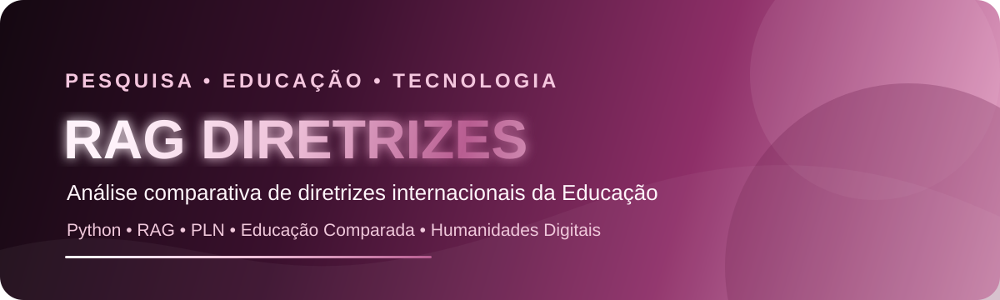

<p align="center">
  
</p>

<p align="center">
  
</p>

<h1 align="center">Denise Moraes</h1>

<p align="center">
  Professora • Pesquisadora • Tecnologia da Informação • Humanidades Digitais
</p>

<p align="center">
  
  
  
  
  
</p>

## Sobre o projeto

Este repositório reúne o desenvolvimento da pesquisa **RAG Diretrizes**, voltada à análise comparativa de diretrizes curriculares internacionais da Educação Básica, com atenção especial à Computação, Educação Digital, Pensamento Computacional e às competências necessárias à formação do cidadão contemporâneo.

A proposta integra métodos de **Educação Comparada**, **Humanidades Digitais**, **Ciência de Dados**, **Processamento de Linguagem Natural** e **Retrieval-Augmented Generation (RAG)** para organizar, consultar e analisar documentos curriculares de diferentes países.

## Objetivo da pesquisa

Construir uma base documental e computacional capaz de apoiar a comparação entre diretrizes educacionais internacionais, identificando convergências, diferenças, competências, habilidades e abordagens relacionadas à formação digital na Educação Básica.

A análise considera também a relação desses documentos com referenciais brasileiros, especialmente a **BNCC** e o **Complemento à BNCC Computação**.

## Eixos de análise

- Computação na Educação Básica
- Educação Digital
- Pensamento Computacional
- Cultura Digital
- Cidadania Digital
- Competências e habilidades
- Formação integral
- Educação Comparada
- Humanidades Digitais
- Políticas curriculares internacionais

## Metodologia computacional

O projeto utiliza uma arquitetura baseada em recuperação e análise de documentos para permitir consultas fundamentadas diretamente no corpus da pesquisa.

```text
Documentos oficiais
        ↓
Extração e tratamento de texto
        ↓
Normalização e organização do corpus
        ↓
Segmentação dos documentos
        ↓
Embeddings / representação textual
        ↓
Indexação vetorial (OpenAI Vector Store como principal; FAISS local como fallback)
        ↓
RAG rastreável
        ↓
Consulta, comparação e análise documental + lexical
```

Também são exploradas técnicas complementares de análise textual, como **TF-IDF**, frequência de termos, similaridade textual, mineração de texto e classificação temática.

## Estado atual do projeto

A implementação atual está organizada em fases metodológicas e passa por um pipeline em que cada camada tem papel específico:

- Análise documental e bibliográfica: organização do corpus, metadados e rastreabilidade;
- Frameworks e regras de processamento: definição dos eixos de análise, stopwords e entidades excluídas;
- Análise lexical exploratória: TF-IDF, similaridade textual e gráficos de apoio;
- Backend vetorial: `openai` como backend principal e `local` como fallback;
- Matriz de evidências: rastreio de indicadores por documento, país e dimensão;
- Sensibilidade do pipeline: verificação de consistência dos resultados obtidos;
- RAG rastreável: recuperação semântica com evidência documental e metadata associada.

## Regras metodológicas do projeto

> A análise lexical não substitui a leitura documental nem a interpretação crítica do pesquisador.

- O TF-IDF e a similaridade textual são usados como ferramentas exploratórias.
- O corpus principal contém 22 países. UNESCO e PISA/OCDE são referências internacionais e não entram na contagem de países nem no bloco comparativo nacional.
- Os resultados computacionais devem ser lidos como pistas de vocabulário e proximidade textual, e não como prova de equivalência curricular.
- A recuperação semântica e o RAG devem retornar evidências vinculadas a documento, país, fonte e categoria analítica.

## Tecnologias

| Área | Tecnologias e métodos |
|---|---|
| Linguagem | Python |
| Recuperação de informação | RAG |
| PLN | tokenização, embeddings, similaridade e análise textual |
| Análise lexical | TF-IDF e frequência de termos |
| Dados | Pandas e estruturas tabulares |
| Corpus | documentos curriculares oficiais |
| Pesquisa | análise documental e Educação Comparada |
| Ambiente | VS Code e GitHub |

## Estrutura planejada

```text
ragdiretrizes/
│
├── assets/             # identidade visual do projeto
├── corpus/             # documentos curriculares
├── rag_project/        # implementação do sistema RAG
├── resultados/         # tabelas e resultados de análise
├── traducoes/          # versões de apoio em português
├── notebooks/          # experimentos e análises
└── README.md
```

## Pesquisa acadêmica

O projeto faz parte de uma investigação acadêmica na interface entre **Educação, Tecnologia da Informação e Humanidades Digitais**.

Minha formação e atuação estão relacionadas à Tecnologia da Informação, à docência e à pesquisa. Sou Mestre em Desenvolvimento Local e desenvolvo estudos em Humanidades Digitais na UFRRJ, utilizando métodos computacionais para investigação de documentos educacionais e políticas curriculares.

## Princípio da pesquisa

> Tecnologia aplicada à pesquisa educacional deve ampliar a capacidade de análise sem substituir a leitura crítica, a interpretação do pesquisador e a verificação das fontes.

## Autoria

**Denise Moraes**  
Professora e Pesquisadora  
Tecnologia da Informação • Educação • Humanidades Digitais

<p align="center">
  <sub>Pesquisa, educação e tecnologia conectadas por dados, documentos e análise crítica.</sub>
</p>
