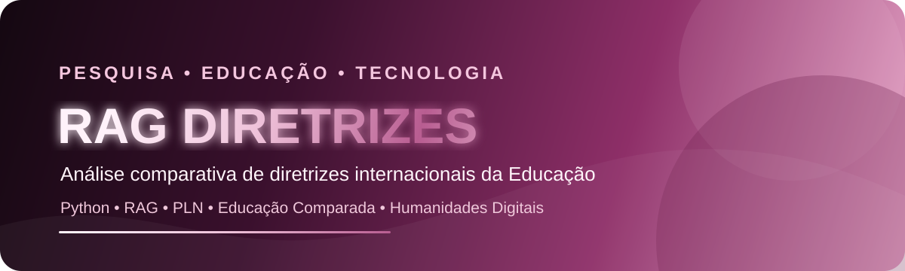

<p align="center">
  
</p>

<p align="center">
  
</p>

<h1 align="center">Denise Moraes</h1>

<p align="center">
  Professora • Pesquisadora • Tecnologia da Informação • Humanidades Digitais
</p>

<p align="center">
  
  
  
  
  
</p>

## Sobre o projeto

Este repositório reúne o desenvolvimento da pesquisa **RAG Diretrizes**, voltada à análise comparativa de diretrizes curriculares internacionais da Educação Básica, com atenção especial à Computação, Educação Digital, Pensamento Computacional e às competências necessárias à formação do cidadão contemporâneo.

A proposta integra métodos de **Educação Comparada**, **Humanidades Digitais**, **Ciência de Dados**, **Processamento de Linguagem Natural** e **Retrieval-Augmented Generation (RAG)** para organizar, consultar e analisar documentos curriculares de diferentes países.

## Objetivo da pesquisa

Construir uma base documental e computacional capaz de apoiar a comparação entre diretrizes educacionais internacionais, identificando convergências, diferenças, competências, habilidades e abordagens relacionadas à formação digital na Educação Básica.

A análise considera também a relação desses documentos com referenciais brasileiros, especialmente a **BNCC** e o **Complemento à BNCC Computação**.

## Eixos de análise

- Computação na Educação Básica
- Educação Digital
- Pensamento Computacional
- Cultura Digital
- Cidadania Digital
- Competências e habilidades
- Formação integral
- Educação Comparada
- Humanidades Digitais
- Políticas curriculares internacionais

## Metodologia computacional

O projeto utiliza uma arquitetura baseada em recuperação e análise de documentos para permitir consultas fundamentadas diretamente no corpus da pesquisa.

```text
Documentos oficiais
        ↓
Extração e tratamento de texto
        ↓
Normalização e organização do corpus
        ↓
Segmentação dos documentos
        ↓
Embeddings / representação textual
        ↓
Indexação vetorial (OpenAI Vector Store como principal; FAISS local como fallback)
        ↓
RAG rastreável
        ↓
Consulta, comparação e análise documental + lexical
```

Também são exploradas técnicas complementares de análise textual, como **TF-IDF**, frequência de termos, similaridade textual, mineração de texto e classificação temática.

## Estado atual do projeto

A implementação atual está organizada em fases metodológicas e passa por um pipeline em que cada camada tem papel específico:

- Análise documental e bibliográfica: organização do corpus, metadados e rastreabilidade;
- Frameworks e regras de processamento: definição dos eixos de análise, stopwords e entidades excluídas;
- Análise lexical exploratória: TF-IDF, similaridade textual e gráficos de apoio;
- Backend vetorial: `openai` como backend principal e `local` como fallback;
- Matriz de evidências: rastreio de indicadores por documento, país e dimensão;
- Sensibilidade do pipeline: verificação de consistência dos resultados obtidos;
- RAG rastreável: recuperação semântica com evidência documental e metadata associada.

## Auditoria, validação e reprodutibilidade

A curadoria do corpus possui uma camada específica de auditoria para permitir comprovação e repetição do processo.

Principais artefatos:

- `OCR_Seletivo_Corpus_RAG.ipynb` — notebook histórico do OCR seletivo aplicado aos documentos bloqueados;
- `Auditoria_Reutilizavel_Corpus_RAG.ipynb` — notebook Colab consolidado para repetir auditoria, OCR, revisão por página e validação do JSONL;
- `rag_project/audit_corpus.py` — auditoria automatizada e reutilizável do catálogo, textos processados e dataset de conteúdo;
- `docs/protocolo_validacao_textos.md` — método passo a passo para validação textual orientada por exceções e reutilização por outros pesquisadores.

Execução local:

```bash
python -m rag_project.audit_corpus --all
```

Relatórios esperados:

```text
dados_derivados/analysis/audit/audit_summary.json
dados_derivados/analysis/audit/processed_page_audit.csv
```

O protocolo preserva os documentos originais, mantém `document_id` e páginas, aplica OCR apenas quando necessário, registra páginas suspeitas para revisão humana e valida a estrutura dos dados antes da indexação vetorial.

### Reconstruir dataset e índice após atualizar o corpus

O inventário do corpus é reconciliado com `rag_project/config/corpus_registry.yaml`. Arquivos novos ficam como `pending_review` até a confirmação da fonte oficial, do nível de ensino e da relação com Computação/educação digital. Eles aparecem no manifesto de auditoria, mas não entram no dataset nem no índice. A construção usa somente documentos `validated` presentes no corpus e lê os arquivos brutos atuais; ela não depende de `documentos.csv` ou `processed_documents.csv` gerados em rodadas anteriores.

No Git Bash, na raiz do repositório:

```bash
python -m rag_project.run_curated_pipeline --run-id regen_20260927_02 --build
```

O comando cria dois datasets rastreáveis: `dataset_original_pages.jsonl` preserva os trechos no idioma da fonte e `dataset_english_pages.jsonl` traduz o corpus completo para inglês em segmentos ligados ao trecho original. O índice FAISS é criado a partir da versão inglesa. A tradução exige `OPENAI_API_KEY` e pode gerar cobrança de API. O índice usa `sentence-transformers/paraphrase-multilingual-MiniLM-L12-v2`, baixado/cacheado na primeira execução. Se precisar exigir o cache local, configure `RAG_EMBEDDING_LOCAL_ONLY=true`; o pipeline falha claramente se não puder carregar o modelo e não substitui embeddings por vetores hash. Para escolher outro modelo, defina `RAG_EMBEDDING_MODEL` antes da execução e gere um índice novo.

Q01–Q13 são executadas por país, após a construção do índice. Com `OPENAI_API_KEY` configurada no ambiente ou em `rag_project/.env`, use o mesmo `run-id` e países que tenham documentos validados:

```bash
for country in australia estonia; do
  python -m rag_project.run_questions_by_country \
    --country "$country" \
    --index "dados_intermediarios/pipeline_runs/regen_20260927_02/index" \
    --out "dados_intermediarios/pipeline_runs/regen_20260927_02/questions/$country" \
    --backend local
done
```

O fluxo padrão continua restrito a documentos `validated`. Para exploração preliminar dos documentos registrados como `pending_review`, existe a opção explícita `--include-pending-review`; ela preserva o status original e não transforma respostas em evidência validada. Na rodada exploratória de 27/09/2026, os 94 documentos registrados dos 22 países foram incluídos sem promover status, e Q01–Q13 foram executadas por país no Vector Store. As respostas dessa rodada permanecem candidatas até conferência humana; Q14 continua condicionada à validação das evidências.

Depois de validar as respostas, gere a matriz dos itens Q01–Q13 e a matriz DLGF 2018 a partir das evidências revisadas:

```bash
python -m rag_project.consolidate_country_responses \
  --input "dados_intermediarios/pipeline_runs/regen_20260927_02/questions" \
  --output "dados_intermediarios/pipeline_runs/regen_20260927_02/question_matrix"
python -m rag_project.build_evidence_matrix \
  --evidence "dados_intermediarios/pipeline_runs/regen_20260927_02/question_matrix/evidencias_consolidadas.csv" \
  --out "dados_intermediarios/pipeline_runs/regen_20260927_02/dlgf_2018"
```

Antes da matriz DLGF, valide manualmente as evidências na coluna `evidence_validation_status` de `evidencias_consolidadas.csv`. A matriz sempre contém as sete áreas do DLGF 2018. `not_assessed` indica ausência de evidência validada; `translation_required` indica que há trechos em japonês/chinês sem tradução para comparação lexical; `no_match_in_reviewed_sample` significa apenas que não houve correspondência lexical naquela amostra revisada. Nenhum desses estados prova ausência curricular. TF-IDF e similaridade textual são pistas de vocabulário, não evidência de equivalência.

Para comparação lexical entre idiomas, prefira gerar um dataset traduzido de forma consistente e depois rode:

```bash
python -m rag_project.analyze_tfidf \
  --input "dados_intermediarios/pipeline_runs/regen_20260927_02/datasets/dataset_english.jsonl" \
  --out "dados_intermediarios/pipeline_runs/regen_20260927_02/tfidf" \
  --text-field english_text
```

A comparação lexical inclui documentos nacionais e as sete áreas do UNESCO DLGF 2018. A tradução por API pode gerar cobrança e exige que o dataset inglês tenha sido criado previamente.

Na rodada exploratória de 27/09/2026, o TF-IDF também foi calculado diretamente sobre `source_text` em `dados_intermediarios/pipeline_runs/todos_paises_exploratorio_20260927_01/datasets/dataset_original_pages.jsonl`. Essa saída fica em `dados_intermediarios/analise_lexical/todos_paises_exploratorio_20260927_01/`. Como os textos estão nos idiomas originais, não há idioma registrado por página e há fontes `pending_review`, essa execução serve apenas para exploração; não deve ser usada como ranking ou comparação lexical normalizada entre países.

## Regras metodológicas do projeto

> A análise lexical não substitui a leitura documental nem a interpretação crítica do pesquisador.

- O TF-IDF e a similaridade textual são usados como ferramentas exploratórias.
- O corpus principal contém 22 países. O UNESCO DLGF 2018 é usado como referencial analítico internacional, não como currículo nacional nem como ranking.
- Os resultados computacionais devem ser lidos como pistas de vocabulário e proximidade textual, e não como prova de equivalência curricular.
- A recuperação semântica e o RAG devem retornar evidências vinculadas a documento, país, fonte e categoria analítica.
- Páginas marcadas como vazias, curtas ou de baixa qualidade devem ser revisadas visualmente antes da liberação.
- A ausência de recuperação semântica não deve ser interpretada automaticamente como ausência conceitual no documento.

## Protocolo de análise dos resultados

A pasta `official_run_20260912` contém a rodada histórica de 12/09/2026. A rodada exploratória de 27/09/2026 está separada em `dados_derivados/analysis/todos_paises_exploratorio_20260927_01/`: 286 respostas para Q01–Q13 nos 22 países, com evidências candidatas ainda sujeitas a revisão. Os dois conjuntos não devem ser combinados. A etapa seguinte é a validação semântica e a interpretação comparativa, não uma nova geração automática de conclusões.

O protocolo completo está em [docs/protocolo_analise_resultados.md](docs/protocolo_analise_resultados.md). Ele define a relação entre objetivos, perguntas, evidências e produtos analíticos, além das regras para não confundir frequência lexical, similaridade textual ou ausência de recuperação com competência curricular comprovada.

## Tecnologias

| Área | Tecnologias e métodos |
|---|---|
| Linguagem | Python |
| Recuperação de informação | RAG |
| PLN | tokenização, embeddings, similaridade e análise textual |
| Análise lexical | TF-IDF e frequência de termos |
| Dados | Pandas e estruturas tabulares |
| Corpus | documentos curriculares oficiais |
| Auditoria textual | PyMuPDF, PaddleOCR seletivo, validação por página e revisão humana |
| Pesquisa | análise documental e Educação Comparada |
| Ambiente | VS Code, Google Colab e GitHub |

## Organização dos dados

Os dados seguem três camadas físicas, preservando os documentos de origem e a reprodutibilidade do pipeline:

```text
dados_brutos/corpus/                  # documentos originais e manifestos de origem
dados_intermediarios/metadata/        # catálogos e manifestos de processamento
dados_intermediarios/processed*/      # OCR e textos preparados
dados_intermediarios/datasets/        # datasets JSONL gerados
dados_intermediarios/analise_lexical/ # saídas de TF-IDF e indicadores
dados_derivados/analysis/             # respostas RAG, matrizes e relatórios finais
```

Os caminhos legados na raiz (`corpus/`, `metadata/`, `data/` e `analysis/`) não fazem mais parte da versão atual. Use exclusivamente as três camadas acima.

## Estrutura planejada

```text
ragdiretrizes/
│
├── assets/             # identidade visual do projeto
├── dados_brutos/       # documentos curriculares originais
├── dados_intermediarios/ # dados processados e metadados
├── dados_derivados/    # análises e resultados reproduzíveis
├── rag_project/        # implementação do sistema RAG e auditoria
├── docs/               # documentação metodológica e protocolos
├── resultados/         # tabelas e resultados de análise
├── traducoes/          # versões de apoio em português
├── notebooks/          # experimentos e análises
└── README.md
```

## Pesquisa acadêmica

O projeto faz parte de uma investigação acadêmica na interface entre **Educação, Tecnologia da Informação e Humanidades Digitais**.

Minha formação e atuação estão relacionadas à Tecnologia da Informação, à docência e à pesquisa. Sou Mestre em Desenvolvimento Local e desenvolvo estudos em Humanidades Digitais na UFRRJ, utilizando métodos computacionais para investigação de documentos educacionais e políticas curriculares.

## Princípio da pesquisa

> Tecnologia aplicada à pesquisa educacional deve ampliar a capacidade de análise sem substituir a leitura crítica, a interpretação do pesquisador e a verificação das fontes.

## Autoria

**Denise Moraes**  
Professora e Pesquisadora  
Tecnologia da Informação • Educação • Humanidades Digitais

<p align="center">
  <sub>Pesquisa, educação e tecnologia conectadas por dados, documentos e análise crítica.</sub>
</p>
