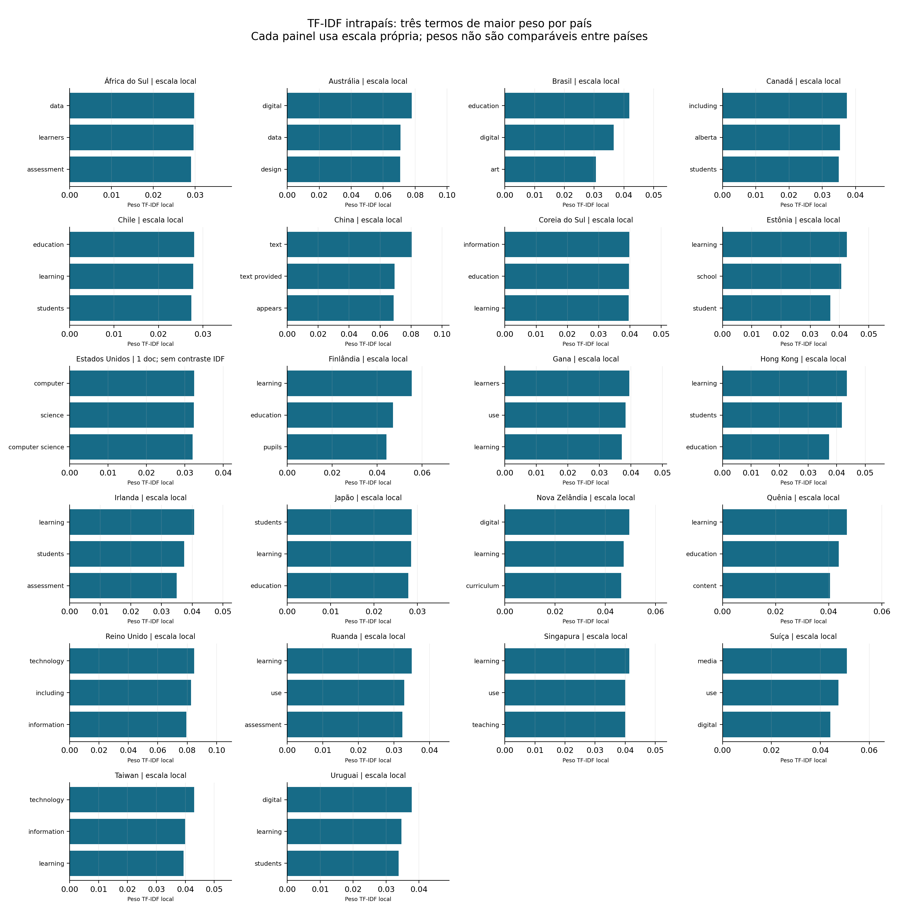
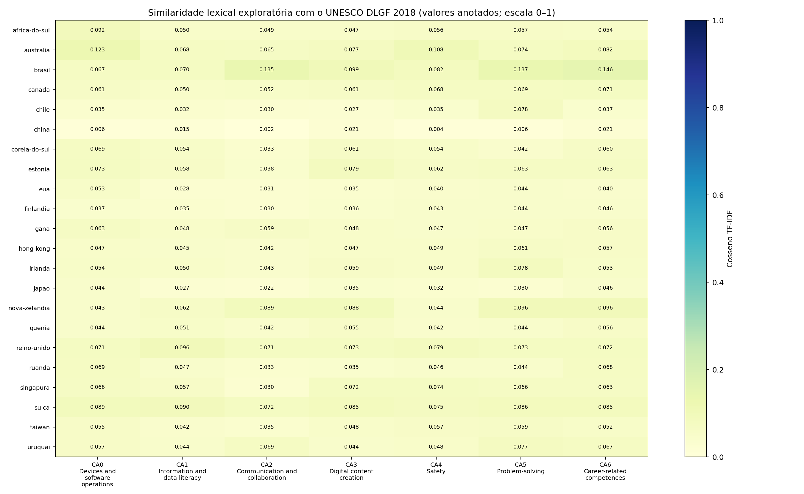

# Apêndice Técnico: Desafios e Decisões Metodológicas

## Escopo

Este apêndice registra os principais desafios técnicos e metodológicos enfrentados na construção do fluxo computacional de análise documental comparativa, bem como as medidas adotadas, os resultados verificáveis e as limitações que permanecem. O corpus reúne documentos curriculares e diretrizes de 22 países; o DLGF 2018 é tratado como referencial analítico, não como país ou medida de qualidade.

As rodadas têm escopos e fotografias do corpus diferentes. A rodada oficial de 12/09/2026 fechou 86 documentos e 8.099 registros, com 286 respostas Q01–Q13, 283 respostas `candidate`, 3 `inconclusive` e 626 evidências. A rodada exploratória iniciada em 27/09/2026 incluiu 94 documentos registrados; 93 produziram texto, totalizando 9.042 páginas nos 22 países. Os números de rodadas distintas não devem ser somados nem tratados como uma única execução.

## Desafios, medidas e situação

| Desafio | Medida técnica ou metodológica | Situação e limite residual |
|---|---|---|
| Seleção e rastreabilidade do corpus | Foi criado registro curado com identificadores, escopo, país, papel documental e status. Os datasets guardam `document_id`, caminho e página. | A pesquisadora confirma que todos os 94 arquivos do corpus foram examinados e validados humanamente. Os 4 `validated` e 90 `pending_review` observados no manifesto de 27/09 são uma fotografia operacional histórica; os 90 status do registro vigente foram reconciliados para `validated`. A validação dos arquivos não significa que cada citação RAG ou correspondência DLGF também esteja validada. |
| Extração de PDF e OCR | O pipeline tenta extração direta com PyMuPDF e pdfplumber; OCR é seletivo, com pytesseract/Tesseract quando necessário. Páginas suspeitas são auditadas por métricas e revisão visual. | OCR e extração podem falhar em tabelas, páginas escaneadas, caracteres asiáticos e diagramações complexas. A configuração do Tesseract no Windows também exigiu resolver disponibilidade no PATH e permissões locais. |
| Correções em páginas específicas | Intervenções foram registradas sem substituir os documentos brutos. No documento chinês AS-CN-02, a página 6 exigiu correção do sumário; a página 7 permaneceu sem texto OCR útil. | A correção local não elimina a necessidade de revisão visual das páginas sinalizadas. A página física do PDF deve ser distinguida da paginação impressa. |
| Paginação e localização de evidências | O mapa preliminar relacionou 9.279 páginas físicas dos PDFs aos localizadores usados na análise. Reparos de evidência usam correspondência normalizada, âncoras textuais e fuzzy matching conservador, com registro das ações. | Deslocamentos de paginação variam por documento. Não se aplica um único deslocamento global, e localizadores automatizados ainda requerem conferência visual quando marcados para revisão. |
| Limite de memória no índice local | O build local com FAISS foi investigado; carregamento simultâneo de textos, chunks e embeddings elevava o uso de RAM e podia travar o VS Code. Para as rodadas principais, adotou-se OpenAI Vector Store/File Search. | FAISS local permanece alternativa, não backend principal da rodada comparativa. A adoção do serviço hospedado reduz a carga local, mas depende de credenciais, rede e custos da API. |
| Respostas em JSON irregular e metadados incompletos | O prompt e o parser foram ajustados para um esquema explícito de `evidences`; scripts de reparo recuperam evidências embutidas em JSON malformado e tentam resolver documento/página no dataset. | Resposta `candidate` é apoio potencial, não validação. Campos não resolvidos permanecem registrados como inconclusivos ou duvidosos; não são preenchidos por inferência silenciosa. |
| Categorias DLGF não oficiais em Q04 | A busca Q04 foi refeita consultando as sete áreas oficiais do DLGF 2018. Na rodada direcionada, 462 hits brutos foram obtidos; 254 foram associados a uma página única por correspondência literal e 91 registros deduplicados permaneceram sem vínculo único. | As áreas retornadas são candidatas até revisão semântica. Rótulos criados pelo modelo que não correspondem às áreas oficiais não foram aceitos como classificação válida. |
| Paráfrase versus cópia literal | O validador separa a síntese RAG do trecho citado. A resposta pode parafrasear, mas a passagem literal de apoio indicada pelo juiz semântico precisa ser confirmada no texto da página física. | A auditoria de 03/10/2026 processou 286 respostas e 619 citações. Houve 201 trechos literais confirmados e 77 paráfrases apoiadas por uma passagem literal confirmada; 337 citações não tiveram suporte semântico verificado, 2 apontaram para páginas não extraídas e 2 para documentos não resolvidos. Todas as 286 respostas mantiveram status geral `conteudo_duvidoso` e exigem revisão humana; esse status conservador não significa que cada citação seja falsa. |
| Custo e duração da validação em lote | A primeira execução de auditoria ficou parada em 9/286. A rotina foi reorientada para reutilizar o dataset original de páginas como cache, evitando reabrir PDFs e repetir extração/OCR para cada resposta. Resultados são gravados em JSONL e workbook. | Chamadas semânticas ainda dependem da API. A cache de páginas reduz extração repetida, mas não elimina custo de inferência. O manifesto deve acompanhar qualquer nova execução. |
| TF-IDF em idiomas diferentes | O cálculo multilíngue inicial não permite comparar diretamente os pesos entre idiomas. Foi criado fluxo que traduz todas as páginas para inglês com `gpt-4o-mini`, reutiliza cache e só calcula após confirmar cobertura integral. | Em 03/10/2026, foram cobertas 9.042 páginas em 19.497 segmentos, abrangendo 22 países. O Japão passou a ter perfil com 907 páginas. A tradução automática continua sendo mediação e precisa de revisão amostral dos termos técnicos. |
| Stopwords e termos funcionais | A lista multilíngue foi complementada por `ENGLISH_STOP_WORDS` do scikit-learn após palavras funcionais inglesas aparecerem no top do Japão. A execução foi refeita e os filtros efetivos são registrados no manifesto. | As stopwords filtram o vocabulário do cálculo, não alteram os textos-fonte. A lista pode remover termos que tenham significado contextual; resultados lexicais continuam exploratórios. |
| Cabeçalhos, rodapés e resíduos de extração | O relatório e o manifesto declaram explicitamente a política aplicada. | Não há remoção automática de cabeçalhos, rodapés, números de página ou elementos repetidos. Esses resíduos podem influenciar os pesos. Uma limpeza futura deve criar campo derivado de análise, preservando `source_text` para auditoria. |
| País com um documento | O pipeline calcula e exibe o vetor TF-IDF, mas sinaliza que não existe contraste documental. | Os Estados Unidos têm um único documento nesta base e aparecem como `single_document_no_idf_contrast`. O IDF fica igual a 1 para todos os termos; o ranking é essencialmente TF normalizada e não deve ser interpretado como contraste entre documentos. |

### Recorte dos Estados Unidos

Nos Estados Unidos, o K–12 Computer Science Framework funciona como uma referência orientadora de abrangência nacional, mas não constitui um currículo federal obrigatório. Em razão da descentralização educacional, estados e distritos podem adotar, adaptar ou desenvolver padrões próprios para o ensino de Computação. Assim, a presença de um framework nacional no corpus não significa que ele seja a única diretriz existente no país; significa que foi selecionado como referência de síntese para a análise comparativa.

Na rodada exploratória registrada neste apêndice, a fonte selecionada é `US_001` (`eua_k12-computer-science-framework_2016.pdf`). O manifesto histórico da rodada a registrava como `pending_review`; após a confirmação de revisão humana de todos os arquivos, o registro vigente foi atualizado para `validated`. Isso valida a curadoria do documento, não transforma cada evidência RAG ou interpretação lexical em conclusão validada.

## Ferramentas efetivamente empregadas

- **Python, JSONL, CSV e pytest:** execução, rastreabilidade e validação estrutural/testes.
- **PyMuPDF e pdfplumber:** extração textual de PDFs; **pytesseract/Tesseract** em OCR seletivo e revisão manual em exceções.
- **OpenAI API:** tradução em inglês e revisão semântica auxiliar; traduções concluídas são armazenadas em cache.
- **OpenAI Vector Store/File Search:** recuperação semântica hospedada nas rodadas principais, preservando filtros por país e metadados.
- **scikit-learn:** TF-IDF e vocabulário de stopwords inglesas; **Matplotlib:** geração dos gráficos finais.
- **Excel/CSV e relatórios de auditoria:** revisão humana de respostas, páginas e citações.

Algumas técnicas foram consideradas ou existiram como alternativas, mas não foram usadas como método final: **BM25 não foi usado**, **PaddleOCR não foi usado** e **FAISS local não foi o índice principal da rodada final**. Portanto, “uso de todas as ferramentas possíveis” não é uma descrição técnica adequada; foram selecionadas ferramentas compatíveis com os objetivos, os recursos disponíveis e os requisitos de rastreabilidade.

## Resultados técnicos consolidados em 03/10/2026

1. A auditoria preliminar RAG cobriu 286 respostas e 619 citações. As 266 respostas `candidate` e 20 `inconclusive` são da rodada exploratória de 27/09 e não devem ser confundidas com as 283 `candidate` e 3 `inconclusive` da rodada oficial de 12/09.
2. O TF-IDF comparável foi executado por país após tradução comum, sem similaridade entre países. Foram produzidos 22 perfis; 21 têm cálculo intrapaís e um não tem contraste por contar com apenas um documento.
3. Os gráficos incluem uma prancha geral com escalas independentes e um PNG por país, incluindo o Japão e os termos dos Estados Unidos, identificados como sem contraste IDF.
4. Testes automatizados cobrem tradução, cobertura, geração de figuras e componentes adjacentes. Na validação completa final, 57 testes passaram e um teste independente de classificação de evidência DLGF falhou (`explicit` esperado, `implicit` retornado); essa falha não foi causada pelo fluxo TF-IDF. O teste de exportação do framework passou quando a suíte foi repetida.
5. A análise exclusiva com o UNESCO DLGF 2018 produziu uma matriz de **22 países × 7 áreas = 154 similaridades**, usando os 93 documentos agregados em inglês. Não foram calculadas similaridades entre países nem incluídos outros referenciais. No Japão, a maior similaridade lexical foi com CA6 (0,0458); nos EUA, com CA0 (0,0534). Esses máximos são apenas pistas lexicais, não evidências de alinhamento ou adoção do framework.

Os gráficos individuais estão em [`assets/tfidf_all_countries_20261003T161344Z/countries/`](../assets/tfidf_all_countries_20261003T161344Z/countries/); por exemplo, [Japão](../assets/tfidf_all_countries_20261003T161344Z/countries/japao_tfidf_top3.png) e [Estados Unidos](../assets/tfidf_all_countries_20261003T161344Z/countries/eua_tfidf_top3.png). Os pesos devem ser lidos somente dentro de cada país.

### Comparação exclusiva com o DLGF

Os dados detalhados e a matriz estão em `dados_intermediarios/analise_lexical/tfidf_dlgf_only_20261003T164840Z/`. A execução não inclui comparação país-país nem outros referenciais. A proximidade lexical foi calculada sobre a tradução inglesa e sobre os nomes/termos bilíngues cadastrados para as áreas DLGF.

## Limitações e salvaguardas de interpretação

O RAG localiza evidências, mas não substitui leitura documental. `candidate` não significa validado; `inconclusive` não significa ausência curricular. A revisão automática pode rejeitar respostas inteiras mesmo quando algumas citações são literais ou semanticamente apoiadas, razão pela qual os resultados de citação e de resposta são reportados separadamente.

TF-IDF representa distribuição lexical, não competência, qualidade, implementação curricular ou equivalência entre países. Como os pesos são ajustados dentro de cada país, não devem ser comparados numericamente entre países. Tradução, OCR, extração e resíduos de layout podem introduzir ruído. A avaliação visual de páginas prioritárias, a validação humana das citações e a revisão amostral das traduções permanecem necessárias antes de conclusões substantivas.

As credenciais da API são mantidas em configuração local ignorada pelo Git e não integram datasets, gráficos ou este apêndice. Artefatos derivados volumosos permanecem em diretórios intermediários/derivados; apenas os gráficos selecionados para apresentação são exportados para `assets/`.

## Documentos de rastreabilidade

- [Fluxo completo da rodada oficial](fluxo_completo_rodada_oficial_rag.md)
- [Rodada oficial de 12/09/2026](rodada_oficial_20260912.md)
- [Resultados preliminares RAG da Avaliação 1](resultados_preliminares_rag_avaliacao_1.md)
- [Estado atual dos resultados](estado_atual_resultados_20261003.md)
- [Procedimento TF-IDF reproduzível](etapa_tfidf.md)
- [Protocolo de validação textual](protocolo_validacao_textos.md)